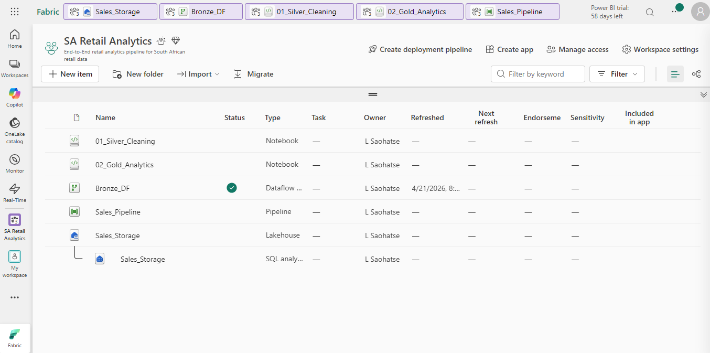
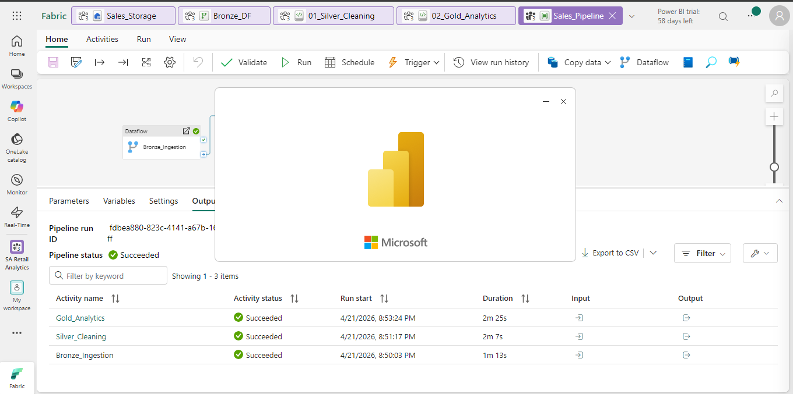

# 🛒 SA Retail Analytics - Microsoft Fabric End-to-End Data Engineering

[](https://fabric.microsoft.com)
[](https://spark.apache.org)
[](https://delta.io)
[](https://powerbi.microsoft.com)
[](./data/sales_data.json)
[](./LICENSE)

> A **production-grade, end-to-end data engineering portfolio project** using Microsoft Fabric.
> Built on a realistic South African retail dataset - Bronze → Silver → Gold medallion architecture, PySpark transformations, automated pipeline, and a live Power BI dashboard.

---

## 📸 Project Overview

| Phase | Component | Status |
|---|---|---|
| 1 | Workspace + Lakehouse setup | ✅ |
| 2 | Bronze ingestion via Dataflow Gen2 | ✅ |
| 3 | Silver cleaning via PySpark notebook | ✅ |
| 4 | Gold analytics (7 tables) | ✅ |
| 5 | Automated pipeline (daily, 06:00 SAST) | ✅ |
| 6 | Power BI dashboard (4 pages, DirectLake) | ✅ |

---

## 🏗️ Architecture

```
┌─────────────────────────────────────────────────────────────────────┐
│                       Sales_Pipeline  (daily, 06:00 SAST)           │
│                                                                     │
│  ┌─────────────────┐    ┌───────────────────┐    ┌───────────────┐  │
│  │  BRONZE LAYER   │───▶│   SILVER LAYER    │───▶│  GOLD LAYER  │  │
│  │  Dataflow Gen2  │    │  PySpark Notebook │    │  PySpark NB  │   │
│  │                 │    │                   │    │              │   │
│  │ customer.csv    │    │ silver_customer   │    │ gold_customer│   │
│  │ product.csv     │    │ silver_product    │    │ gold_product │   │
│  │ orders.csv      │    │ silver_orders     │    │ gold_segment │   │
│  └─────────────────┘    └───────────────────┘    │ gold_category│   │
│         ▲                                        │ gold_trends  │   │
│         │                                        │ gold_stores  │   │
│  JSON API (GitHub)                               │ gold_payments│   │
│  SA retail data                                  └──────┬───────┘   │
└──────────────────────────────────────────────────────────┼─────────┘
                                                           │
                                                     DirectLake
                                                           │
                                              ┌────────────▼──────────┐
                                              │    Power BI Dashboard │
                                              │  4 pages • ZAR KPIs   │
                                              └───────────────────────┘
```

---

## 🇿🇦 South African Context

The dataset simulates a realistic SA multi-store retail environment:

- **20 customers** - real SA names across Johannesburg, Cape Town, Durban, Pretoria, Hermanus, Stellenbosch, and more
- **20 products** - SA brands: Sasko, Albany, Koo, Clover, Nescafé, Simba, Bar-One, Rooibos, Domestos, Ariel, Nivea, Colgate
- **120 orders** - placed at Pick n Pay, Checkers, Woolworths, Shoprite, Spar, and Clicks
- **Currency**: ZAR (South African Rand) - total dataset value: **R 117,513.86**
- **Payment methods**: Card, Cash, EFT, SnapScan, Zapper
- **Customer segments**: Premium, Regular, Budget

---

## 📁 Repository Structure

```
sa-retail-analytics/
├── data/
│   └── sales_data.json             ← 🇿🇦 SA retail source dataset (115 KB)
│
├── docs/
│   └── IMPLEMENTATION_PLAN.md      ← Full step-by-step build guide with screenshots
│
├── notebooks/
│   ├── 01_silver_cleaning.ipynb       ← PySpark: clean & transform bronze → silver
│   └── 02_gold_analytics.ipynb        ← PySpark: aggregate silver → gold (7 tables)
│
├── pipeline/
│   └── pipeline_config.json        ← Pipeline reference config
│
├── powerbi/
│   └── POWERBI_GUIDE.md            ← Power BI setup, DAX measures & dashboard guide
│
├── screenshots/
│   ├── phase1_workspace_setup.png   ← Phase 1: Fabric workspace created
│   ├── phase2_lakehouse_bronze.png  ← Phase 2: Lakehouse + bronze files
│   ├── phase2_dataflow_gen2.png     ← Phase 2: Dataflow Gen2 configuration
│   ├── phase3_silver_notebook.png   ← Phase 3: Silver notebook running
│   ├── phase3_silver_tables.png     ← Phase 3: Silver Delta tables in Lakehouse
│   ├── phase4_gold_tables.png       ← Phase 4: Gold tables + KPI preview
│   └── phase5_pipeline_run.png      ← Phase 5: Pipeline success + schedule
│
└── README.md                        ← You are here
```

---

## 🚀 Quick Start

### Prerequisites

- Microsoft Fabric workspace - [free trial](https://fabric.microsoft.com)
- Power BI Desktop - [free download](https://powerbi.microsoft.com/desktop)
- Python 3.9+ (to run data generator locally)

### 1. Fork & Clone

```bash
git clone https://github.com/Lehlohonolo-Saohatse/Data-Engineering-Sales-Analytics-Using-Microsoft-Fabric-Project.git
cd sa-retail-analytics
```

### 2. Host the data

Push to GitHub and copy your raw file URL:

```
https://raw.githubusercontent.com/Lehlohonolo-Saohatse/Data-Engineering-Sales-Analytics-Using-Microsoft-Fabric-Project/main/data/sales_data.json
```

### 3. Follow the implementation plan

See [`docs/IMPLEMENTATION_PLAN.md`](./docs/IMPLEMENTATION_PLAN.md) — fully illustrated with screenshots at every phase.

---

## 📊 Screenshots

### Phase 1 — Workspace Setup


> The `SA Retail Analytics` workspace is created in Microsoft Fabric. From here you create the Lakehouse, Dataflows, Notebooks, and Pipeline.

---

### Phase 2 — Dataflow Gen2 + Bronze Layer


> Dataflow Gen2 (`Bronze_DF`) connects to the GitHub JSON source and creates three queries: `Customer`, `Product`, and `Orders`. Each query is expanded, typed as Text, and saved to `Files/bronze/` in the Lakehouse.


> After running `Bronze_DF`, three CSV files appear under `SalesStorage → Files → bronze`: `customer.csv`, `product.csv`, and `orders.csv`.

---

### Phase 3 — Silver Notebook + Delta Tables


> The `01_Silver_Cleaning` PySpark notebook reads the bronze CSVs, removes duplicates, trims whitespace, casts types, and writes three Silver Delta tables.


> `silver_customer`, `silver_product`, and `silver_orders` Delta tables appear under `SalesStorage → Tables`. The orders table holds 460 rows (one row per line item).

---

### Phase 4 — Gold Tables


> The `02_Gold_Analytics` notebook produces 7 Gold Delta tables. The `gold_customer` preview shows customers ranked by lifetime revenue in ZAR, with total dataset revenue of **R 117,513.86**.

---

### Phase 5 — Pipeline Run & Schedule


> `Sales_Pipeline` chains all three activities — Bronze ingestion, Silver cleaning, and Gold analytics — and completed in **4 minutes 54 seconds**. It is scheduled to run daily at **06:00 SAST**.


---
### Phase 6 — Workspace at the end



> The `SA Retail Analytics Workspace` workspace is created in Microsoft Fabric. From here you create the Lakehouse, Dataflows, Notebooks, and Pipeline.


---

### Phase 7 — Connecting the Lakehouse to the Power Bi



> `Power BI` Now lets visualize the data in Power BI. Current Phase of the Project. Since I am on a free account I cannot directly connect the Lakehouse to the Power BI, but an alternative of creating the CSVs, and then importing them to the Power Bi is the plan.

---

## 📈 Gold Layer — Business Outputs

| Table | Rows | Business Question |
|---|---|---|
| `gold_customer` | 20 | Who are the top-spending customers by lifetime value? |
| `gold_product` | 20 | Which products generate the most revenue and units sold? |
| `gold_segment` | 3 | How does spend differ across Premium / Regular / Budget? |
| `gold_category` | 7 | Which product categories drive the most revenue? |
| `gold_monthly_trend` | 12 | What are the monthly revenue trends? |
| `gold_store_performance` | 8 | Which stores perform best? |
| `gold_payment_methods` | 5 | How do customers prefer to pay? |

---

## 🗺️ Data Dictionary

<details>
<summary><strong>customers</strong> — 7 columns</summary>

| Column | Type | Example |
|---|---|---|
| customer_id | STRING | C001 |
| name | STRING | Sipho Dlamini |
| email | STRING | sipho.dlamini@gmail.com |
| phone | STRING | 071 234 5678 |
| city | STRING | Johannesburg |
| province | STRING | Gauteng |
| segment | STRING | Premium |
</details>

<details>
<summary><strong>products</strong> — 5 columns</summary>

| Column | Type | Example |
|---|---|---|
| product_id | STRING | P001 |
| name | STRING | Sasko White Bread 700g |
| category | STRING | Groceries |
| price | DOUBLE | 19.99 |
| stock | INT | 500 |
</details>

<details>
<summary><strong>orders</strong> — 13 columns</summary>

| Column | Type | Example |
|---|---|---|
| order_id | STRING | ORD0001 |
| customer_id | STRING | C003 |
| order_date | DATE | 2024-03-14 |
| order_year | INT | 2024 |
| order_month | INT | 3 |
| order_quarter | INT | 1 |
| store | STRING | Woolworths V&A |
| payment_method | STRING | SnapScan |
| product_id | STRING | P014 |
| quantity | INT | 2 |
| unit_price | DOUBLE | 299.99 |
| line_total | DOUBLE | 599.98 |
| order_total | DOUBLE | 989.95 |
</details>

---

## 🛠️ Tech Stack

| Tool | Purpose |
|---|---|
| Microsoft Fabric OneLake | Data storage (Lakehouse, Delta tables) |
| Dataflow Gen2 | Bronze ingestion from JSON API |
| PySpark Notebooks | Silver cleaning & Gold aggregations |
| Delta Lake | Table format for all Silver + Gold layers |
| Microsoft Fabric Pipeline | Orchestration & daily scheduling |
| Power BI Desktop + Service | Dashboard visualisation (DirectLake) |

---

## 📄 Licence

MIT - free to use for portfolio, learning, and commercial projects.
