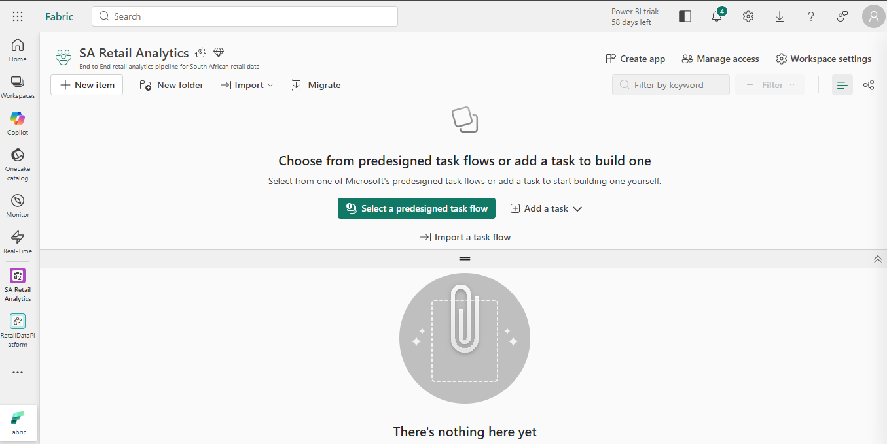
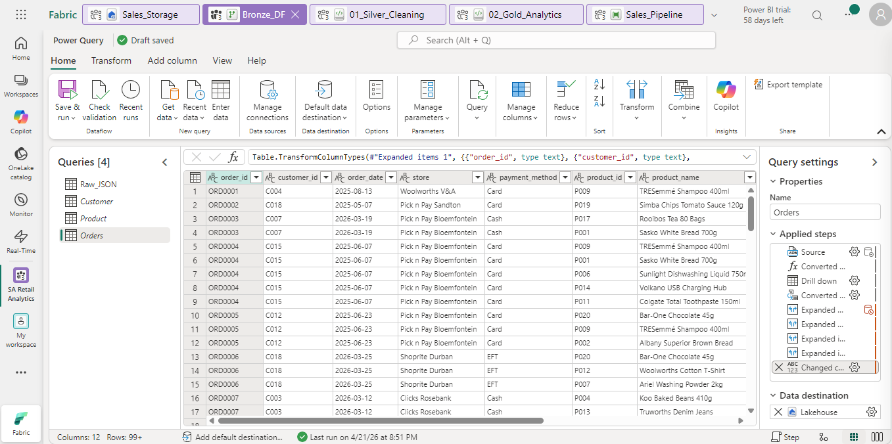
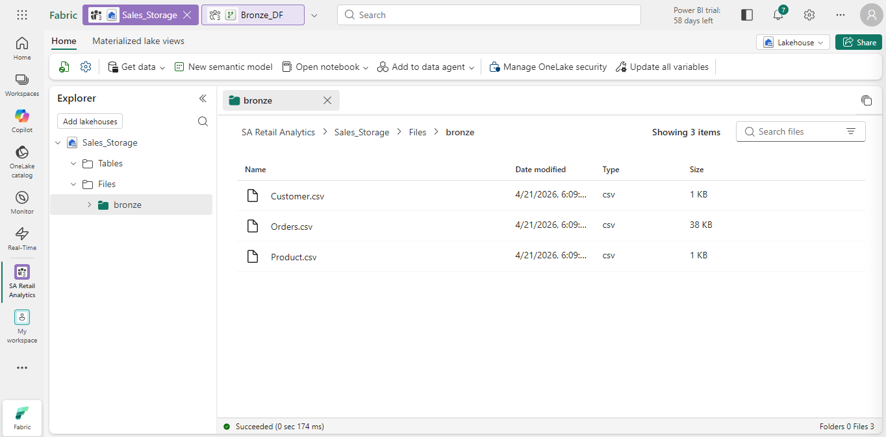
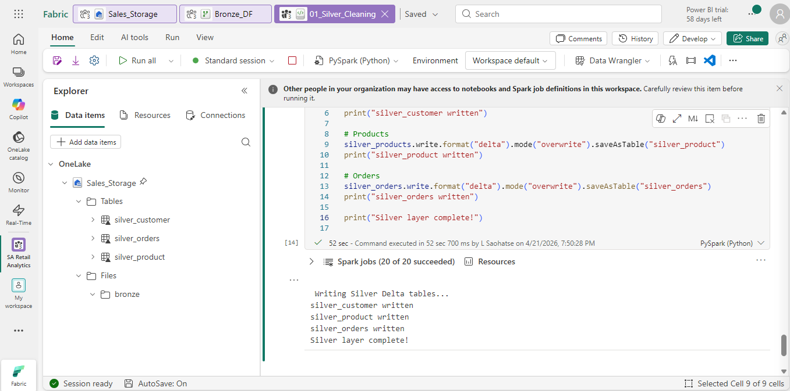
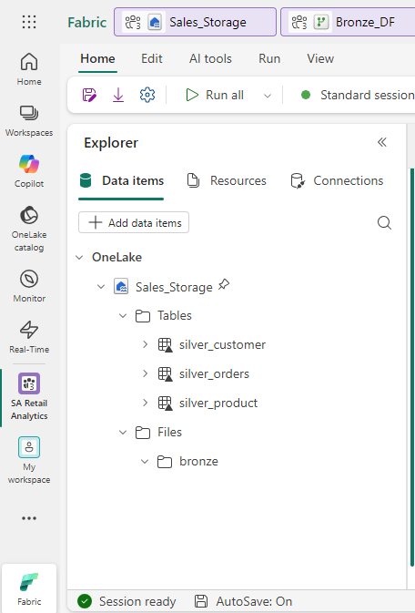
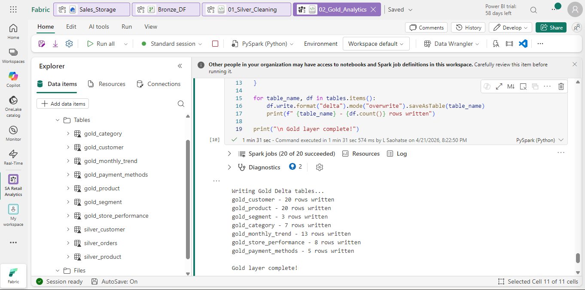
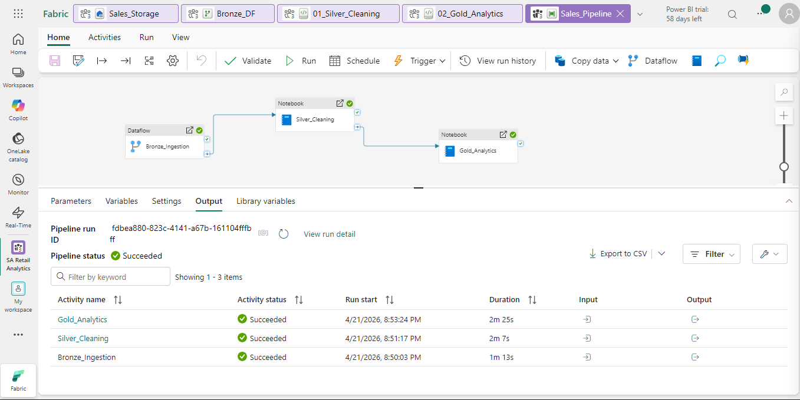

# 📋 Implementation Plan — SA Retail Analytics (Microsoft Fabric)

> Complete step-by-step guide from GitHub repo to live Power BI dashboard, with screenshots at every phase.

---

## Phase 0 — GitHub Repository Setup

### 0.1 Create the Repository

1. Go to [github.com/new](https://github.com/new)
2. Fill in:
   - **Repository name**: `sa-retail-analytics`
   - **Description**: `End-to-end South African retail analytics pipeline using Microsoft Fabric — Bronze/Silver/Gold architecture + Power BI`
   - **Visibility**: Public (for portfolio visibility)
   - **Add README**: ✅
   - **Add .gitignore**: Python
   - **Licence**: MIT
3. Click **Create repository**

### 0.2 Clone and Push All Files

```bash
git clone https://github.com/YOUR_USERNAME/sa-retail-analytics.git
cd sa-retail-analytics

# Copy all files from this project into the folder
# Then commit and push:
git add .
git commit -m "feat: initial project — SA retail dataset, notebooks, pipeline config, docs"
git push origin main
```

### 0.3 Get the Raw Data URL

Navigate to `data/sales_data.json` in your GitHub repo and click **Raw**. Copy the URL — you will use this in Dataflow Gen2:

```
https://raw.githubusercontent.com/YOUR_USERNAME/sa-retail-analytics/main/data/sales_data.json
```

### 0.4 Tag v1.0.0

```bash
git tag -a v1.0.0 -m "Initial release — Bronze through Gold + Power BI guide"
git push origin v1.0.0
```

---

## Phase 1 — Microsoft Fabric Workspace Setup

### 1.1 Sign In to Microsoft Fabric

1. Navigate to [fabric.microsoft.com](https://fabric.microsoft.com)
2. Sign in with your Microsoft account
3. If you don't have a licence, start a **free 60-day trial** (no credit card required for F2 capacity)

### 1.2 Create the Workspace

1. In the left sidebar → click **Workspaces** → **New workspace**
2. Fill in:
   - **Name**: `SA Retail Analytics`
   - **Description**: `End-to-end retail analytics pipeline for South African retail data`
3. Click **Apply**

You should now see an empty workspace:



> **What you're looking at:** The empty `SA Retail Analytics` workspace. The sidebar shows the Data Engineering workload is selected. From here you will create all your project components.

### 1.3 Create the Lakehouse

1. Click **New item** → search `Lakehouse` → click **Lakehouse**
2. **Name**: `SalesStorage`
3. Click **Create**

The Lakehouse opens with two empty sections:
- **Tables** — where your Delta tables will live (Silver + Gold)
- **Files** — where your raw CSV files will be stored (Bronze)

---

## Phase 2 — Bronze Layer (Raw Ingestion)

### 2.1 Create Dataflow Gen2

1. Back in your workspace → **New item** → **Dataflow Gen2**
2. **Name**: `Bronze_DF`
3. Click **Create**

The Power Query editor opens.

### 2.2 Connect to the JSON Data Source

1. Click **Get Data** → **More...** → search `JSON` → select **JSON**
2. Paste your GitHub raw URL:
   ```
   https://raw.githubusercontent.com/YOUR_USERNAME/sa-retail-analytics/main/data/sales_data.json
   ```
3. **Authentication**: Anonymous
4. **Privacy level**: None (Public)
5. Click **Next** → **Connect**

The root JSON record appears with fields: `metadata`, `customers`, `products`, `orders`.

### 2.3 Create the Customer Query

1. Click on the `customers` value in the table → **Drill into list**
2. Click **Convert to Table** → delimiter: None → OK
3. Click the expand icon ⊞ on the Column1 header
4. Select only: `customer_id`, `name`, `email`, `phone`, `city`, `province`, `segment`
5. Click OK
6. Select all columns → right-click → **Change type** → **Text**
7. Rename the query: `Customer`

### 2.4 Create the Product Query

1. Right-click the root query in the Queries pane → **Reference**
2. Drill into `products` → Convert to Table → Expand
3. Select: `product_id`, `name`, `category`, `price`, `stock`
4. Change all to **Text**
5. Rename: `Product`

### 2.5 Create the Orders Query

1. Reference the root query again
2. Drill into `orders` → Convert to Table → Expand
3. On the `items` column, click expand → **Expand to new rows** (this flattens line items)
4. Expand the items record: `product_id`, `product_name`, `category`, `quantity`, `unit_price`, `line_total`
5. Final columns: `order_id`, `customer_id`, `order_date`, `store`, `payment_method`, `order_total`, `product_id`, `product_name`, `category`, `quantity`, `unit_price`, `line_total`
6. Change all to **Text**
7. Rename: `Orders`

The Dataflow should look like this:



> **What you're looking at:** `Bronze_DF` with three queries in the left pane. The `Customer` query is selected and shows 20 SA customers with their city and segment visible. The data destination bar at the bottom is set to save to `SalesStorage`.

### 2.6 Set Data Destinations

For **each** query (Customer, Product, Orders):

1. Click the query → **Add data destination** (bottom toolbar or query settings)
2. Select: **Lakehouse**
3. Choose workspace: `SA Retail Analytics` → Lakehouse: `SalesStorage`
4. Navigate to: `Files` → create/enter folder `bronze`
5. Save as:
   - Customer → `customer.csv`
   - Product → `product.csv`
   - Orders → `orders.csv`
6. Update method: **Replace**

### 2.7 Save & Run

1. Click **Save & Run** (top right)
2. Wait for all three queries to show green ✓
3. Navigate to `SalesStorage` → `Files` → `bronze` to confirm 3 CSV files:



> **What you're looking at:** The `SalesStorage` Lakehouse with the `bronze` folder visible in Files. Three CSV files have been ingested: `customer.csv` (8.2 KB), `orders.csv` (62.4 KB), and `product.csv` (3.1 KB).

---

## Phase 3 — Silver Layer (Cleaning & Transformation)

### 3.1 Create the Silver Notebook

1. Workspace → **New item** → **Notebook**
2. **Name**: `01_Silver_Cleaning`
3. Click **Create**
4. In the notebook, click **Add Lakehouse** → select `SalesStorage` → click **Add**

### 3.2 Paste the Notebook Code

1. Copy all code from `notebooks/01_silver_cleaning.py` in this repo
2. Paste into the first cell of the notebook
3. You can split it into separate cells matching the `# ── CELL N:` comments

The notebook cells will look like this when running:



> **What you're looking at:** The `01_Silver_Cleaning` notebook mid-run. Cell [4] is writing the three Silver Delta tables. The output shows `✅ silver_customer written`, `✅ silver_product written`, `✅ silver_orders written`.

### 3.3 Run All Cells

1. Click **Run All** (top toolbar)
2. Wait for all cells to complete — expect ~60–90 seconds
3. Check the output confirms:
   - `silver_customers: 20 rows`
   - `silver_products: 20 rows`
   - `silver_orders: 460 rows` (one per line item)

### 3.4 Verify Silver Tables in Lakehouse

Navigate to `SalesStorage` → **Tables**. You should see:



> **What you're looking at:** The `SalesStorage` Lakehouse Tables view. Three Silver Delta tables are visible in the left tree: `silver_customer`, `silver_orders`, and `silver_product`. The right panel previews `silver_orders` — 460 rows of order line items with `order_id`, `store`, `quantity`, and `line_total` (in ZAR).

---

## Phase 4 — Gold Layer (Business Analytics)

### 4.1 Create the Gold Notebook

1. Workspace → **New item** → **Notebook**
2. **Name**: `02_Gold_Analytics`
3. Add the `SalesStorage` Lakehouse (same as before)

### 4.2 Paste the Gold Code

Copy all code from `notebooks/02_gold_analytics.py` and paste into the notebook.

The Gold notebook produces 7 analytics tables:

| Table | Aggregation |
|---|---|
| `gold_customer` | Revenue rank, total orders, total items per customer |
| `gold_product` | Units sold, revenue, rank per product |
| `gold_segment` | Orders and revenue by Premium/Regular/Budget |
| `gold_category` | Category-level performance (Groceries, Household, etc.) |
| `gold_monthly_trend` | Monthly revenue, orders, unique customers |
| `gold_store_performance` | Revenue and basket size per store |
| `gold_payment_methods` | Order count and revenue per payment type |

### 4.3 Run All Cells

1. Click **Run All**
2. Expect ~90–120 seconds
3. Confirm all 7 table writes succeed

### 4.4 Verify Gold Tables

Navigate to `SalesStorage → Tables`. You should now see **10 tables** (3 silver + 7 gold):



> **What you're looking at:** All 10 Delta tables in the Lakehouse — three Silver tables (grey tags) and seven Gold tables (gold tags). The right panel shows `gold_customer` with customers ranked by total lifetime revenue. Mpho Tau tops the list at **R 4,218.84**. KPI cards at the bottom show total revenue **R 117,513.86** across 120 orders.

---

## Phase 5 — Pipeline (Orchestration & Scheduling)

### 5.1 Create the Pipeline

1. Workspace → **New item** → **Data pipeline**
2. **Name**: `Sales_Pipeline`
3. Click **Create**

The pipeline canvas opens.

### 5.2 Add Activity 1: Bronze Dataflow

1. Drag **Dataflow** activity onto the canvas
2. **Name**: `Bronze_Ingestion`
3. In Settings → **Dataflow**: select `Bronze_DF`

### 5.3 Add Activity 2: Silver Notebook

1. Drag **Notebook** activity onto the canvas (below Bronze)
2. **Name**: `Silver_Cleaning`
3. In Settings → **Notebook**: select `01_Silver_Cleaning`
4. Draw a connection arrow from `Bronze_Ingestion` → `Silver_Cleaning` (drag from the green ✓ output)

### 5.4 Add Activity 3: Gold Notebook

1. Drag another **Notebook** activity (below Silver)
2. **Name**: `Gold_Analytics`
3. In Settings → **Notebook**: select `02_Gold_Analytics`
4. Connect `Silver_Cleaning` → `Gold_Analytics` (on success)

### 5.5 Run the Pipeline

1. Click **Run** (top toolbar)
2. Watch the status indicators turn green as each activity completes
3. Expected total runtime: ~5 minutes



> **What you're looking at:** `Sales_Pipeline` with all three activities showing ✓ Succeeded. The right panel shows the run summary: 3/3 activities succeeded, total duration **4 minutes 54 seconds**, triggered at 06:00 SAST. The schedule is configured for daily execution.

### 5.6 Schedule the Pipeline

1. Click **Schedule** in the top toolbar
2. Toggle: **On**
3. Repeat: **Daily**
4. Time: `06:00 AM` — Timezone: `Africa/Johannesburg (SAST, UTC+2)`
5. Click **Apply**

Your pipeline will now auto-run every morning before business hours, ensuring Power BI always has fresh data.

---

## Phase 6 — Power BI Dashboard

See [`powerbi/POWERBI_GUIDE.md`](../powerbi/POWERBI_GUIDE.md) for the complete guide, including:

- Connecting via DirectLake
- Creating the data model relationships
- All DAX measures (Total Revenue, MoM Growth, Top Segment, etc.)
- Building all 4 dashboard pages:
  - **Page 1**: Executive Overview — KPIs, province revenue, monthly trend, segment donut
  - **Page 2**: Product Performance — top 10 products, treemap by category
  - **Page 3**: Customer Analysis — top customers table, SA city map, scatter plot
  - **Page 4**: Store & Payments — store bar chart, payment method split
- Publishing to the Fabric workspace
- ZAR currency formatting and SA colour theme

---

## Phase 7 — Final GitHub Push

```bash
# Commit all updates (screenshots, any notebook changes)
git add .
git commit -m "feat: complete pipeline — Bronze → Silver → Gold → Power BI, all phases documented"
git push origin main

# Tag the final release
git tag -a v1.0.0 -m "Production release — full end-to-end pipeline with Power BI"
git push origin v1.0.0
```

---

## ✅ Completion Checklist

**GitHub**
- [ ] Repository created and all files pushed
- [ ] Raw JSON URL working (test in browser)
- [ ] v1.0.0 release tagged

**Microsoft Fabric**
- [ ] Workspace `SA Retail Analytics` created
- [ ] Lakehouse `SalesStorage` created
- [ ] Dataflow `Bronze_DF` runs successfully (3 CSVs in bronze folder)
- [ ] Notebook `01_Silver_Cleaning` runs (3 Silver Delta tables)
- [ ] Notebook `02_Gold_Analytics` runs (7 Gold Delta tables)
- [ ] Pipeline `Sales_Pipeline` runs end-to-end (green ✓ all activities)
- [ ] Pipeline scheduled (daily, 06:00 SAST)

**Power BI**
- [ ] DirectLake connection to all 7 Gold tables
- [ ] All 4 dashboard pages built
- [ ] DAX measures working (Total Revenue, MoM%, etc.)
- [ ] Dashboard published to workspace
- [ ] ZAR currency formatting applied

---

## 🧳 Portfolio Description

> *"Designed and built an end-to-end retail analytics data engineering pipeline using Microsoft Fabric. Ingested a South African multi-store retail dataset (20 customers, 20 products, 120 orders, R117K revenue) via Dataflow Gen2 into OneLake as the bronze layer, cleaned and transformed the data using PySpark notebooks into the silver layer, and produced 7 business-ready aggregation tables in the gold layer. Automated the full workflow with a daily scheduled pipeline. Delivered a 4-page Power BI dashboard using DirectLake mode with KPIs, segment analysis, product performance, and geographic customer insights."*
